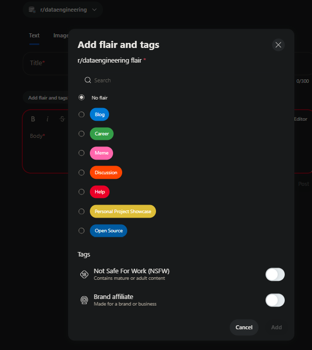

## Dev Environment
Create `.env` file in the root directory and add the environment variables included in the `.env.template` file.

### Set up the environment with VSCode Dev Container
- Install the Remote - Containers extension in VSCode
- Open the project in VSCode
- Click on the green icon in the bottom left corner
- Select `Reopen in Container`
- Initialize db `python etl/init_etl.py`
- Start development server `flask run --debug --host=0.0.0.0 --port=8000`

## Production Environment
My VM IP address is `165.227.120.80`. To follow along, you can create a VM on Digital Ocean or any other cloud provider and replace the IP address with your own.

### Create SSH Key
```bash
ssh-keygen -t rsa -b 4096 -C "your_email@example.com"
ssh-copy-id root@165.227.120.80
```

### Create project directory in `home`
```bash
ssh root@165.227.120.80
cd /home
mkdir rag-reddit
cd rag-reddit
```

### Set up Docker containers the project
#### Transfer files to the VM
```bash
scp -r ./docker root@165.227.120.80:/home/rag-reddit/docker
scp .env.prod root@165.227.120.80:/home/rag-reddit

# Or use rsync instead of scp, which handles overwrites better:
rsync -av --delete ./docker/ root@165.227.120.80:/home/rag-reddit/docker
rsync -av --delete .env.prod root@165.227.120.80:/home/rag-reddit/
```

#### Initialize containers
```bash
ssh root@165.227.120.80
docker stop $(docker ps -a -q)
docker rm $(docker ps -a -q)
docker volume rm $(docker volume ls -q)
cd /home/rag-reddit/docker
docker compose -f docker-compose.prod.yml -p rag-reddit up -d --build
docker compose -f docker-compose.prod.yml -p rag-reddit start
docker compose -p rag-reddit down --volumes
```

##### Check Postgres initialize correctly
After running this commands you should see two tables `documents` and `posts` in the database.
```bash
docker exec -it postgres-reddit bash
psql -U <your_root_user> -d <your_db_name>
\dt
```

## Ingestion Pipeline
AWS Lambda functions are used to ingest reddit posts and build the knowledge base in the RAG system.
Reddit are retrieved with the specified frequencies:
- 30 *Best monthly posts* are retrieved daily at 10:00 AM `{"iterations": 1, "n": 30, "t": "month"}`
- 600 *Best yearly posts* are retrieved every Friday at 08:00 AM `{"iterations": 6, "n": 100, "t": "year"}`
- 1000 *Best all-time posts* are retrieved every Friday at 06:30 AM `{"iterations": 10, "n": 100, "t": "all"}`

### Set up the environment for a Lambda function
For Lambda layers, the path structure needs to match what Lambda expects [docs](https://docs.aws.amazon.com/lambda/latest/dg/python-layers.html).

To ensure that the PATH variable picks up your layer content, your layer .zip file should have its dependencies in the following folder paths:
- `python`
- `python/lib/python3.x/site-packages`
For example, the resulting layer .zip file that you create in this tutorial has the following directory structure:
```
layer_content.zip
└ python
    └ lib
        └ python3.11
            └ site-packages
                └ requests
                └ <other_dependencies> (i.e. dependencies of the requests package)
                └ ...
```

Approach here is to create a virtual environment, install the dependencies, and then copy the dependencies to a `zip` file.

**Python packages that contain compiled code, such as NumPy and pandas, aren't always compatible with Lambda runtimes by default.** See [docs](https://repost.aws/knowledge-center/lambda-python-package-compatible) for more information. Run the command below to ensure the correct Linux-compatible versions of the dependencies.

```bash
https://repost.aws/knowledge-center/lambda-python-package-compatible

```bash
pip install --target venv/lib/python3.11/site-packages \
    --platform manylinux2014_x86_64 \
    --implementation cp \
    --python-version 3.11 \
    --only-binary=:all: \
    --upgrade -r requirements.txt
```

## Reddit API

### Reddit Glossary
Here is a list of the six different types of objects returned from Reddit:    
- `t1` These objects represent Comments
- `t2` These objects represent Redditors           
- `t3` These objects represent Submissions (i.e., posts)
- `t4` These objects represent Messages
- `t5` These objects represent Subreddits   
- `t6` These objects represent Awards

### Querying Subreddits

#### About a subreddit
```python
response = requests.get(
    "https://oauth.reddit.com/r/dataengineering/about",
    headers={
        'Authorization': f"bearer {os.getenv('TOKEN')}",
        "User-Agent": os.getenv('USER_AGENT'),
    },
)
```
Another informational endpoint:
- `https://oauth.reddit.com/r/dataengineering/about/moderators`


```json
{
    "kind": "t5",
    "data": {
        "display_name": "dataengineering",
        "header_img": null,
        "title": "Data Engineering",
        "allow_galleries": true,
        "icon_size": null,
        "primary_color": "",
        "active_user_count": 63,
        "icon_img": "",
        "display_name_prefixed": "r/dataengineering",
        "accounts_active": 63,
        "public_traffic": false,
        "subscribers": 218387,
        "user_flair_richtext": [],
        "videostream_links_count": 0,
        "name": "t5_36en4",
        ...
    }
}
```
#### Listing submissions a.ka. Posts
Use the following endpoints
- `[/r/subreddit]/hot`
- `[/r/subreddit]/new`
- `[/r/subreddit]/random`
- `[/r/subreddit]/rising`
- `[/r/subreddit]/top`
- `[/r/subreddit]/controversial`

Take it with a grain of salt but this is how each endpoint works

- `hot` = `upvotes/time` what's been getting a lot up upvotes/comments recently
- `new` sorts post by the time of submission with the newest at the top of the page
- `random` is a random post from the subreddit
- `rising` is what is getting a lot of activity (comments/upvotes) right now
- `top` = `upvotes - downvotes`
- `controversial` those that that have a high number of upvotes and downvotes, indicating a division in opinion among users.

##### Default is hot
These two endpoints are equivalent
- "https://oauth.reddit.com/r/dataengineering/"
- "https://oauth.reddit.com/r/dataengineering/hot"

##### `t` parameter is only possible for `top` and `controversial`
- As expected we cannot add `new`, `hot`, and `rising` do not have (as expected)
- t is one of (hour, day, week, month, year, all)

#### Pagination Limitations
- Reddit’s API uses pagination to retrieve posts. You can fetch a limited number of posts in a single request (up to 100 at a time), and to get more, you have to make subsequent requests using `after` and `before` tokens to get the next "page" of posts.

#### Dynamic nature of the platform
- New posts are being created all the time in active subreddits. As users continuously submit new content, the most recent posts are always changing. If you are trying to scrape or retrieve all posts in a subreddit, by the time you make multiple API requests, new posts may have been added.
  - **This means that the list of posts you're pulling can become outdated as you progress through your API requests.**
- Similarly, posts can also be updated or removed (by moderators or the original poster), or they might receive new comments and upvotes
  - **causing them to shift in rank or popularity**

####  Historical Data Accessibility:
- Reddit's API prioritizes recent content, so after a certain point, very old posts may no longer be available via the API, especially for large subreddits. You can access only a limited timeframe of posts from the API due to the way data is stored and indexed.
- For very old or archived posts, the API might not return them, even if you paginate through all the available content.

#### Searching a subreddit

### Tags  

On Reddit, tags are labels used to categorize and organize posts within a subreddit. They help users quickly identify the type of content or the topic of the post.

Below are the tags for the data engineering subreddit. **To increase data quality those post tagged as `Meme` are not included in the dataset.**

